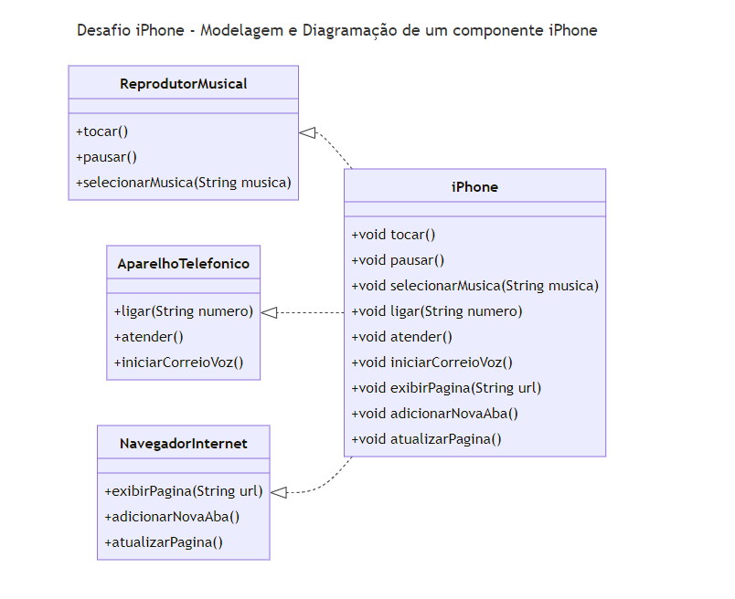

# Desafio iPhone - Modelagem e Diagramação de um componente iPhone 

Neste desafio, sou responsável por modelar e diagramar a representação do componente iPhone abrangendo as funcionalidades Reprodutor Musical, Aparelho Telefonico e Navegador na Internet. 


## Diagrama UML


<details>
  <summary>Código do Diagrama UML</summary>
   ---
   title: Desafio iPhone - Modelagem e Diagramação de um componente iPhone 
   ---
   classDiagram
      class AparelhoTelefonico {
       +ligar(String numero)
      +atender()
      +iniciarCorreioVoz()
   }

   class ReprodutorMusical {
      +tocar()
      +pausar()
      +selecionarMusica(String musica)
   }

   class NavegadorInternet {
       +exibirPagina(String url)
      +adicionarNovaAba()
       +atualizarPagina()
   }

   class iPhone {
      +void tocar()
       +void pausar()
       +void selecionarMusica(String musica)
      +void ligar(String numero)
      +void atender()
       +void iniciarCorreioVoz()
       +void exibirPagina(String url)
       +void adicionarNovaAba()
       +void atualizarPagina()
   }

   iPhone ..|> ReprodutorMusical
   iPhone ..|> AparelhoTelefonico
   iPhone ..|> NavegadorInternet

</details>

## Funcionalidades

### Reprodutor Musical
- `tocar()`: Toca a música.
- `pausar()`: Pausa a música.
- `selecionarMusica(String musica)`: Seleciona uma música específica.

### Aparelho Telefônico
- `ligar(String numero)`: Liga para um número.
- `atender()`: Atende uma chamada.
- `iniciarCorreioVoz()`: Inicia o correio de voz.

### Navegador na Internet
- `exibirPagina(String url)`: Exibe uma página web.
- `adicionarNovaAba()`: Adiciona uma nova aba no navegador.
- `atualizarPagina()`: Atualiza a página web atual.

## Como Executar

1. Compile os arquivos Java:
   ```bash
   javac src/*.java

Link do repositorio do desafio: (url)https://github.com/digitalinnovationone/trilha-java-basico/tree/main/desafios/poo

